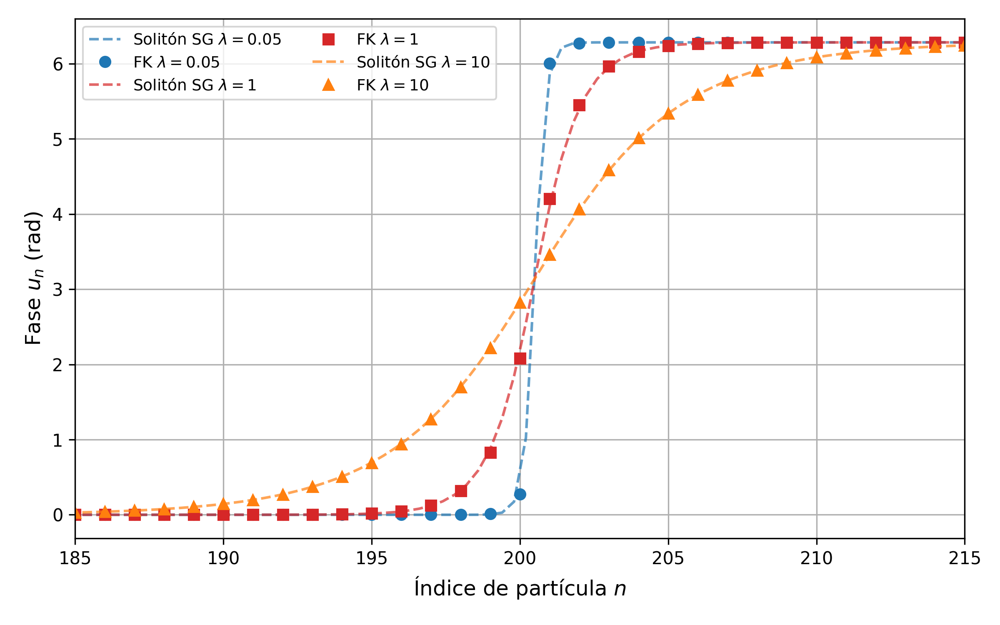
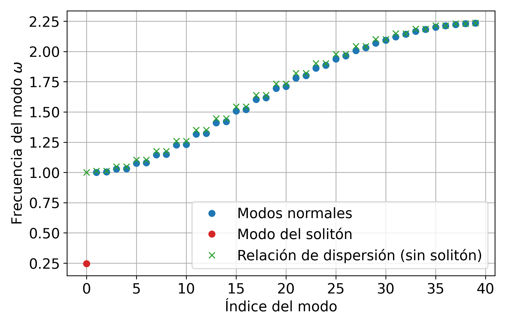
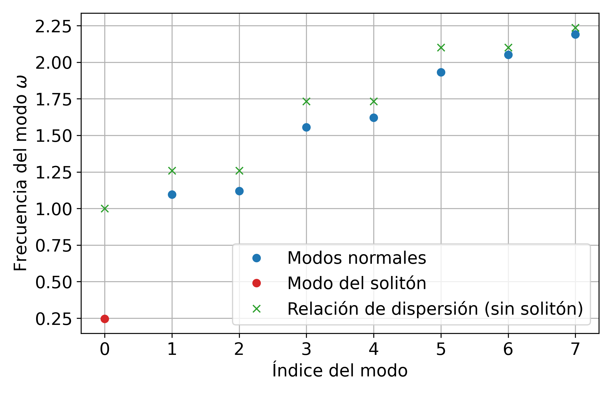
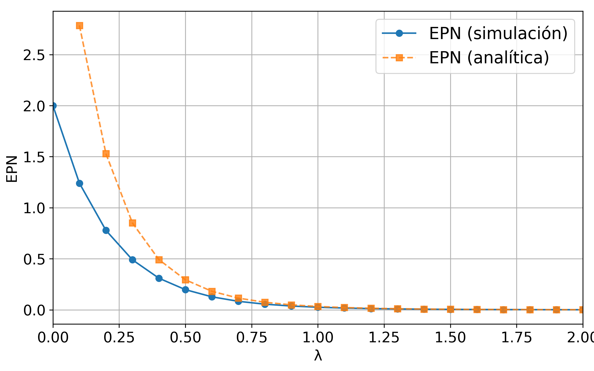

# Figures

This folder contains the main figures generated in the project 
"Topological Solitons in the Frenkel–Kontorova Model".

All results were obtained from numerical simulations using RK4 time integration
with damping relaxation and spectral analysis via GSL.

## Figures included

- **fig1_kink_profiles_lambda_comparison.png**  
  Comparison between discrete FK soliton profiles and the sine-Gordon continuum limit for different coupling strengths.

  

- **fig2_normal_modes_spectrum_N40.png**  
  Normal mode spectrum around the relaxed kink configuration (N = 40).
  Includes the internal soliton mode and comparison with the phonon dispersion relation.

  

- **fig3_normal_modes_spectrum_N8.png**  
  Normal mode spectrum for small system size (N = 8), illustrating finite-size effects.

  

- **fig4_peierls_nabarro_barrier_vs_lambda.png**  
  Peierls–Nabarro barrier as a function of coupling λ.
  Numerical simulation results compared with analytical approximation.

  
